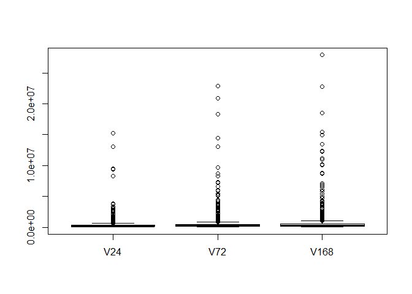
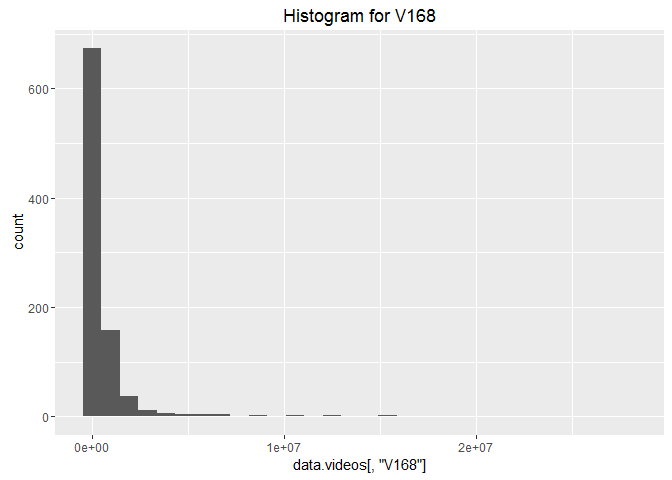
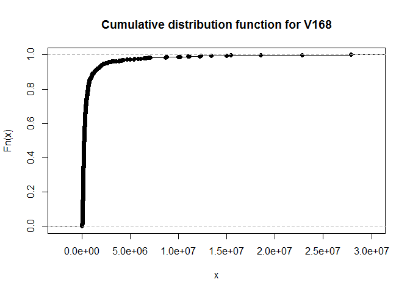
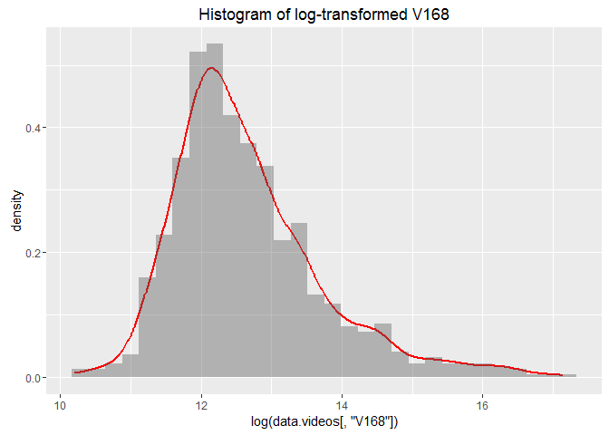
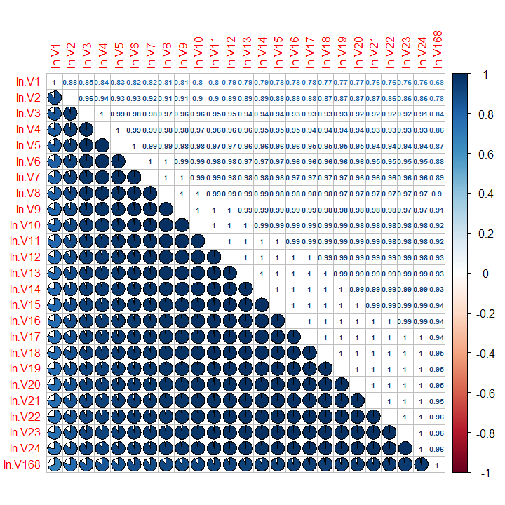
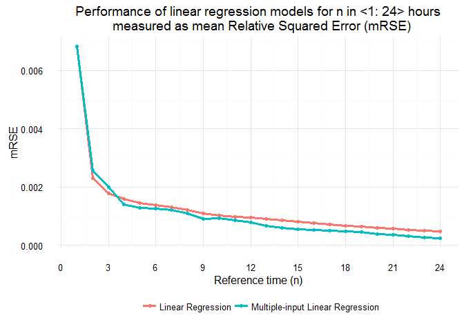

#### TP: recruitment exercise
* Author:           DG
* Date:             29DEC2016
* Last  mod. date:  08JAN2017
* Input data:       data.csv

## 0. Reading packages, setting working directory


```r
set.seed(1234567)
rm(list = ls())
if (!require("pacman")) install.packages("pacman")
```

```
## Loading required package: pacman
```

```r
pacman::p_load(data.table, dplyr, ggplot2, caret, nortest, corrplot, moments)

library(data.table)
library(dplyr)
library(ggplot2)
library(caret)
library(nortest) # Anderson-Darling test for normality
library(corrplot)
library(moments) # skewness
```

## 1. Reading data


```r
# setting working directory...

wd <- "F:\\Damian\\Praca\\2016\\Toolplox Data Scientist\\Tooploox_Data_Scientist_Exercise (1)\\Tooploox_Data_Scientist_Exercise"
setwd(wd)

data.videos <- fread(".\\Input_data\\data.csv") %>% as.data.frame
```

Checking the class of read object (data.frame), the first & last 6
observations to check if data was loaded correctly. Results are not outputted due
to their size.


```r
class(data.videos) # checking object class
head(data.videos) # checking the first...
tail(data.videos) # ...and last 6 observations of the data set to check if it was loaded correctly
```


```r
dim(data.videos) # Number of rows & columns
```

```
## [1] 916 169
```

```r
sum(is.na(data.videos)) # checking if there are any missing values
```

```
## [1] 0
```

Naming variables properly: id and the number of views after i-th hour.

```r
names(data.videos) <- c("id", paste0("V", 1:168))
```

### 1.1 Basic stats for v(24), v(72), v(168)


```r
summary(data.videos[, c("V24", "V72", "V168")])
```

```
##       V24                V72                V168         
##  Min.   :   21173   Min.   :   26162   Min.   :   27139  
##  1st Qu.:  124866   1st Qu.:  148326   1st Qu.:  153346  
##  Median :  194358   Median :  237418   Median :  252287  
##  Mean   :  376766   Mean   :  613303   Mean   :  743210  
##  3rd Qu.:  326667   3rd Qu.:  433612   3rd Qu.:  522259  
##  Max.   :15284639   Max.   :22916701   Max.   :27898237
```

```r
boxplot(data.videos[, c("V24", "V72", "V168")])
```


Taking a closer look at the means for video views it can be seen that after 72 hours
on average a given videos has 62% (=743210/613303 - 1) more views than after 24 hours
and 2 times more views after 168 hours. It can be also read that the increase in
views between 3 and 7 days after publishing is on average at level ~20%
(=743210/613303 - 1).

### 1.2 Distribution of v(168)


```r
qplot(data.videos[, "V168"], main = "Histogram for V168", bins = 30)
```



```r
plot(ecdf(data.videos[, "V168"]), main = "Cumulative distribution function for V168")
```


The distribution reminds some kind of Weibull distribution?

### 1.3 Distribution of log-transformed v(168)


```r
qplot(log(data.videos[, "V168"]), geom = "blank",
  main = "Histogram of log-transformed V168") +   
  geom_line(aes(y = ..density.., colour = I("red")), stat = "density", size = 1) +
  geom_histogram(aes(y = ..density..), alpha = 0.4, bins = 30) 
```



```r
ad.test(log(data.videos[, "V168"]))
```

```
## 
## 	Anderson-Darling normality test
## 
## data:  log(data.videos[, "V168"])
## A = 17.512, p-value < 2.2e-16
```

```r
shapiro.test(log(data.videos[, "V168"]))
```

```
## 
## 	Shapiro-Wilk normality test
## 
## data:  log(data.videos[, "V168"])
## W = 0.92821, p-value < 2.2e-16
```
The distribution looks a bit similar to the normal one, however both Shapiro
and Anderson-Darling test suggest rejection of null hypothesis of the data 
being distributed normally. The skewness at level
1.1599781 suggests that the distribution is skewed to
the right.

### 1.4 Outliers of v(168)


```r
data.videos$ln.V168 <- log(data.videos$V168)
mean.ln.V168 <- mean(data.videos$ln.V168)
sd.ln.V168 <- sd(data.videos$ln.V168)
low.3sigma <- mean.ln.V168-sd.ln.V168*3
high.3sigma <- mean.ln.V168+sd.ln.V168*3
```

Removing outliers:

```r
data.videos <- data.videos[data.videos$ln.V168>=low.3sigma &
                             data.videos$ln.V168<=high.3sigma,]
```

As a result of outlier removal process, 15 observations were removed.

### 1.5 Correlations between log-transformed v(1:24) and log-transformed v(168)


```r
for(i in 1:24){
  
  # Adding log-transformed V1-V24
  
  data.videos[[paste0("ln.V", i)]] <- log(data.videos[[paste0("V", i)]])
  
  # If calculating a natural logarithm results in Inf, mean from this variable
  # is inputted
  
  data.videos[[paste0("ln.V", i)]] <- ifelse(data.videos[[paste0("ln.V", i)]] == -Inf,
                                             mean(data.videos$ln.V1[data.videos$ln.V1 != -Inf]),
                                             data.videos[[paste0("ln.V", i)]])
}
log.cor <- cor(data.videos[, c(paste0("ln.V", c(1:24, 168)))])
corrplot.mixed(log.cor, lower = "pie", upper = "number", tl.pos = "lt", 
               tl.cex = 1, number.cex = 0.6, pch.cex = 5, cl.cex = 1/par("cex"))
```



### 1.6 Split

Spitting data into training (90%) and test (10%) sets:


```r
split.vec <- sample(1:nrow(data.videos), size = floor(0.9*nrow(data.videos)))
data.train <- data.videos[split.vec,]
data.test <- data.videos[-split.vec,]
```

### 1.7-9 OLS, multiple-input OLS & evaluation of predictors


Creating a vector with variable names:


```r
(pred.single.var <- paste0("ln.V", 1:24))
```

```
##  [1] "ln.V1"  "ln.V2"  "ln.V3"  "ln.V4"  "ln.V5"  "ln.V6"  "ln.V7" 
##  [8] "ln.V8"  "ln.V9"  "ln.V10" "ln.V11" "ln.V12" "ln.V13" "ln.V14"
## [15] "ln.V15" "ln.V16" "ln.V17" "ln.V18" "ln.V19" "ln.V20" "ln.V21"
## [22] "ln.V22" "ln.V23" "ln.V24"
```

Prediction for models with single regresors:


```r
mRSE.single.var <- pred.mRSE(vars = pred.single.var,
                             target = "ln.V168",
                             train = data.train,
                             test = data.test)
mRSE.single.var$mRSE.test
```

```
##  [1] 0.0068298057 0.0023124753 0.0017890998 0.0015863300 0.0014522931
##  [6] 0.0013673630 0.0013013972 0.0012069497 0.0010908590 0.0010252535
## [11] 0.0009869171 0.0009440198 0.0009012966 0.0008546808 0.0008066865
## [16] 0.0007626109 0.0007155447 0.0006733554 0.0006366968 0.0006012064
## [21] 0.0005676787 0.0005363355 0.0005060792 0.0004748116
```

The model which minimized mRSE on the test set was the 
24th one, so it 
was the one with log-transformed V24.


```r
mRSE.single.var$RMSE.train
```

```
##  [1] 0.41928326 0.34403177 0.26357309 0.24023410 0.22066449 0.20123536
##  [7] 0.18329548 0.16663618 0.15254138 0.14118357 0.13226730 0.12427461
## [13] 0.11750035 0.11136646 0.10532627 0.09972780 0.09435373 0.08993844
## [19] 0.08610465 0.08252391 0.07912080 0.07592840 0.07310578 0.07052027
```

The model which minimized RMSE on the training set was the
24th one, so it 
also wasis the one with log-transformed V24.

Prediction for models with multiple regresors:


```r
pred.multiple.vars <- c()
for(i in 1:24){
  pred.multiple.vars <- c(pred.multiple.vars,
                          paste0("ln.V", 1:i, collapse = " "))
}

mRSE.multiple.vars <- pred.mRSE(vars = pred.multiple.vars,
                                target = "ln.V168",
                                train = data.train,
                                test = data.test)

mRSE.multiple.vars$mRSE.test
```

```
##  [1] 0.0068298057 0.0025615451 0.0019911602 0.0014003344 0.0012792466
##  [6] 0.0012669012 0.0012092244 0.0010941569 0.0008991543 0.0009235673
## [11] 0.0008641742 0.0007871492 0.0006727876 0.0006051535 0.0005535804
## [16] 0.0005270796 0.0004935108 0.0004796801 0.0004554811 0.0003880751
## [21] 0.0003494044 0.0003057818 0.0002718681 0.0002517738
```

The model which resulted in minimum mRSE on the test set was the 
24th one,
therefore it contained all log-transformed 24 variables.


```r
mRSE.multiple.vars$RMSE.train
```

```
##  [1] 0.41928326 0.34280709 0.25467486 0.22427517 0.19664600 0.16867020
##  [7] 0.15034439 0.13481625 0.12624182 0.11643074 0.10869342 0.09819476
## [13] 0.09313077 0.08754225 0.07847271 0.07467053 0.07356452 0.07311675
## [19] 0.06968463 0.06544018 0.06063189 0.05782865 0.05582976 0.05223296
```

The model which resulted in minimum RMSE on the training set was the 
24th one,
therefore it also contained all log-transformed 24 variables.

### 1.10 mRSE visualization

Preparing data for ggplot2 - melting in order to plot multiple lines on one plot:


```r
mRSE.compare <- cbind(index = seq_along(mRSE.single.var$mRSE.test),
                      mRSE.single.var = mRSE.single.var$mRSE.test, 
                      mRSE.multiple.vars = mRSE.multiple.vars$mRSE.test) %>%
  data.frame %>%
  melt(id = "index")

head(mRSE.compare) # checking the first 6 observations
```

```
##   index        variable       value
## 1     1 mRSE.single.var 0.006829806
## 2     2 mRSE.single.var 0.002312475
## 3     3 mRSE.single.var 0.001789100
## 4     4 mRSE.single.var 0.001586330
## 5     5 mRSE.single.var 0.001452293
## 6     6 mRSE.single.var 0.001367363
```

Adding labels for data for ggplot2:


```r
mRSE.compare[,2] <- ifelse(mRSE.compare[,2] == "mRSE.single.var",
                           "Linear Regression",
                           "Multiple-input Linear Regression")
head(mRSE.compare) # checking the first 6 observations
```

```
##   index          variable       value
## 1     1 Linear Regression 0.006829806
## 2     2 Linear Regression 0.002312475
## 3     3 Linear Regression 0.001789100
## 4     4 Linear Regression 0.001586330
## 5     5 Linear Regression 0.001452293
## 6     6 Linear Regression 0.001367363
```

Plot in ggplot2:


```r
ggplot(mRSE.compare, aes(x = index, y = value, colour = variable)) + 
  geom_line(size = 1.2) +
  geom_point() +
  xlab("Reference time (n)") +
  ylab("mRSE") +
  scale_x_continuous(breaks = seq(0, 25, 3)) +
  # scale_y_continuous(breaks = seq(0, 0.003, 0.0005)) +
  ggtitle("Performance of linear regression models for n in <1: 24> hours
  measured as mean Relative Squared Error (mRSE)") +
  theme_minimal() +
  theme(legend.position = "bottom", legend.title=element_blank())
```


